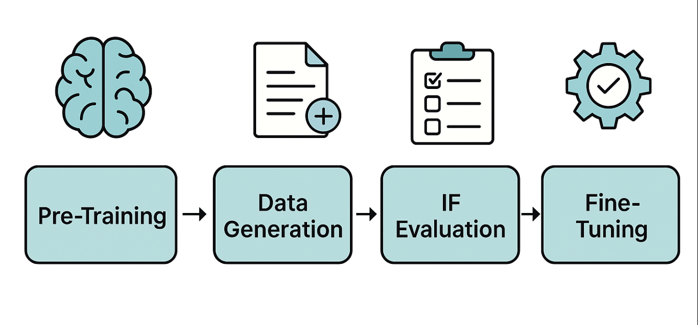
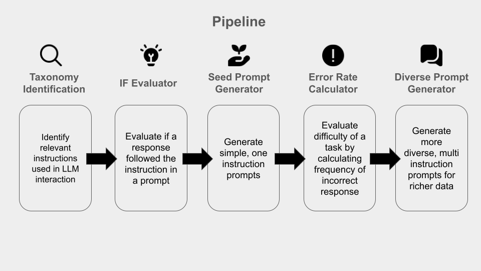

# Data Engine for Supervised Fine-Tuning of Large Language Models


## 📌  Overview

This project was work done for the LLM360 Group (https://www.llm360.ai/), a group dedicated to developing fully open sourced language models. This project was desgined to create a high-quality instruction-following dataset and evaluates how well models adhere to instructions. Inspired by recent research on instruction tuning (e.g., IFEval, Tulu), this tool helps generate prompts, responses, and difficulty ratings for your own fine-tuning or evaluation pipelines.

## ✨Features

- **🧾 Dataset Generator**: Automatically generates diverse instruction-following prompts and responses to train and evaluate your model.
- **✅ IF Evaluator**: Assesses whether a model correctly follows instructions using multiple evaluation criteria, including keyword matching, format checking, and more.
- **📊 Error Rate Calculator**: Evaluate the difficulty of a task by seeing how often the language model generating the data follows it incorrectly.

## Highlights
- **One Click Data Generation**: Completely automatically generate (prompt, response) pairs with the constraints of your choosing
- **Smart Evaluation Engine**: Confidently check if the response in a data point follows the instructions in the prompt
- **Difficulty Tagging**: Allows you to see how many responses got a particular prompt wrong to evaluate difficulty of certain constraints
- **Clean Output Format**: Saves examples in .jsonl for seamless integration with fine-tuning or evaluation pipelines.



## 🧪Prompt & Response Samples:
>Chosen Instructions: Max Word Count, Keyword Exclusion
> **📝 Prompt:**  
>As a health coach, your job is to create a weekly meal plan that supports weight loss goals while ensuring balanced nutrition. Focus on including a variety of fruits, vegetables, proteins, and whole grains without using any processed foods. Your response must NOT contain the word processed.  Your response must not exceed 100 words.

> **✅ Response:**  
>**Weekly Meal Plan** // Breakfast: Overnight oats with chia seeds, berries, and almond milk // Snack: Apple slices with almond butter // Lunch: Quinoa salad with chickpeas, cucumbers, and tomatoes // Snack: Carrot sticks and hummus // Dinner: Grilled chicken with steamed broccoli and sweet potatoes // Snack: Greek yogurt topped with walnuts and honey // Hydration: Aim for 8 cups of water daily and herbal teas.

> **📝 Prompt:**  
>"As a creative writer, your task is to compose a short poem about the beauty of nature while reflecting on personal experiences.  \n\nYour response must NOT contain the word nature.  Your response must not exceed 100 words

> **✅ Response:**  
>In morning's glow, the world awakes //  Soft whispers of the breeze it makes //  \nGolden rays dapple the forest floor //  Where memories linger, like tales of yore //  I wandered paths where wildflowers bloom //  In muted colors, dispelling gloom //  The mountain echoes my laughter's song //  In sprawling meadows, I felt I belong //  Each rustling leaf, a soft embrace //  Reminds me of time, its gentle pace //  With every step, my heart takes flight //  In the quiet dance of day and night

> **📝 Prompt:**
>You are a student in a creative writing class, tasked with drafting a short story that explores the theme of friendship without using the word \"love.\" You need to focus on the nuances of companionship and shared experiences. Your response must NOT contain the word love. Your response must not exceed 100 words.  

> **✅ Response:**
> "The sun dipped low as Mia and Jake sat on the worn wooden dock, feet dangling above the water's surface. They reminisced about the laughter shared during summer adventures, the secrets whispered under starlit skies. When storms swept through their lives, they offered solace, grounding each other with quiet understanding. With every inside joke and spontaneous dance, their bond deepened, creating an unspoken promise to always be there. Beneath the resilient oak tree, they carved their initials, a testament to years woven together, the quiet joy of simply being side by side, navigating life's unpredictable currents

## 🎯Project Motivation

The motivation behind this project is to enhance models' ability to follow diverse instructions effectively. Precise Instruction Following (Precise IF) helps train models that are not only capable of completing tasks but also understand the nuances of the task descriptions. This is especially important for tasks that require high levels of precision, such as text generation, summarization, and reasoning.

The use of instruction-following fine-tuning has shown promise in making models more effective, with fewer training examples required to achieve good performance. As seen in studies like the IFEval and Tulu papers, precise instruction-following is critical for improving models' generalization across tasks.

## 🚧Roadmap

The project will continue to evolve with the following goals:

- **Math/Coding**: Integrate math and coding challenges to further evaluate models' reasoning abilities.
- **Chain of Thought**: Incorporate chain-of-thought reasoning into instruction-following tasks to assess how models reason step-by-step.
- **HuggingFace Integration**: Allow users to share their synthetic data with the public on HuggingFace

## 💻 Getting Started

To get started with the project, follow these steps:

### 1. Create a New Environment
It's recommended to use a virtual environment to keep dependencies isolated:

```bash
python -m venv venv
source venv/bin/activate  # On Windows use `venv\Scripts\activate`
```

### 2. Install Dependencies
Install the required dependencies using pip:

```bash
pip install openai
```

### 3. Set Up OpenAI API Key
To use OpenAI's API, you need to have an API key. Create an OpenAI account and get your API key from [here](https://platform.openai.com/api-keys). Once you have it:

```bash
export OPENAI_API_KEY="your_api_key_here"   # On Windows use `set OPENAI_API_KEY=your_api_key_here`
```

### 4. Clone the Repository
You can clone this repository using Git:

```bash
git clone https://github.com/koidebot/Synthetic-Data-Generation.git
cd Synthetic-Data-Generation
```

## Data Generation

To generate instruction-following data, run the provided script. You will be prompted to select the type of data you want to generate.

```bash
python prompt_generation.py
```

### Select the Type of Data
Choose from options like different levels of difficulty, types of instructions (e.g., Keywords, Length Constraints, etc.), and more.

The generated data will be saved in a file named `if_pairs.jsonl`.

## References

- **IFEval**: [IFEval: A Benchmark for Evaluating Instruction Following in Large Language Models](https://github.com/google-research/google-research/tree/master/instruction_following_eval)
- **Tulu**: [Tulu: An Instruction Following Dataset with Task-specific Annotations](https://github.com/allenai/tulu)
- **LIMA**: [LIMA: A Lightweight Instruction-Following Model with 1,000 Data Points](https://arxiv.org/abs/2305.11206)
